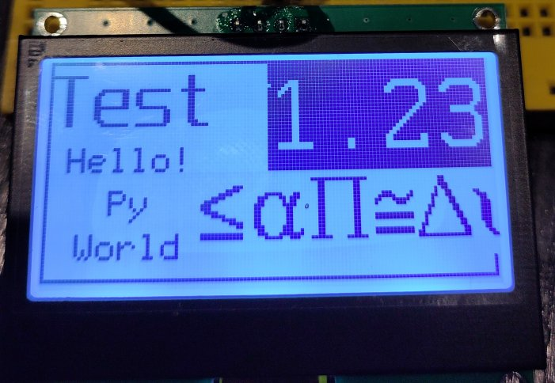
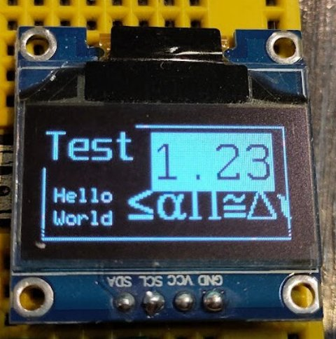

# Fonts for the MicroPython framebuffer

A collection of fonts sourced from the [u8g2](https://github.com/olikraus/u8g2) project and packaged for use on small devices, with small displays, running [MicroPython](https://micropython.org/)

These fonts have been processed using the tools provided in Peter Hinches excellent [`font-to-py`](https://github.com/peterhinch/micropython-font-to-py) repo, and can be used with either his (comprehensive) [writer](https://github.com/peterhinch/micropython-font-to-py/tree/master/writer) class, or the **easy FrameBuffer font** writer in this repo

These can be used with any display that has a driver for the built-in microPyton [framebuffer](https://docs.micropython.org/en/latest/library/framebuf.html), I intend to build a driver database here for all screens tested and known to work

## Status
Working and tested on a ssd1306 i2c OLED display and a st7567 i2c LCD


# Fonts
Font files are in the [`mpy-fonts`](mpy-fonts) folder
* Currently there are 92 font/size combinations available
* See the `README` there for a description, a table of all the fonts and heights, and the conversion tool itself

This is a *limited* subset of the `U8G2` fonts, many of the fonts available there are in an older version of `.bdf` font file format that is not supported by the converter tool. Others have unclear or burdonsome licence restrictions :innocent:

The selection provided here covers the default U8G2 fonts, a lot of common X11 fonts and the 'spleen' small font set. There are some symbol and icon fonts but I wish the selction was better, sorry

# Drivers
The font writer should work with all displays that have a MicroPython framebuffer compatible driver

A selection of 'good' drivers is provided,along with some documentation on using your own driver, in the [`drivers`](drivers) folder

## Alternatives
If you are implementing a full 'GUI', or have a color display, especially a large(ish) one, then you should consider the alternatives below. They support large displays, full color displays, have GUI elements, and are faster.

The fonts in this repo will work with Peter Hinches comprehensive `writer` class:
* https://github.com/peterhinch/micropython-font-to-py/blob/master/writer/WRITER.md
This is a good class to use if you are driving a console type display since it has goodies like word-wrap, tab alignment, etc.

Also from the same author are the display drivers here:
* https://github.com/peterhinch/micropython-nano-gui/blob/master/DRIVERS.md
These support many larger and color displays; they can use the fonts from my font packs. They are part of a complete 'small gui' Library for Micropython.

Another great resource, especially for display drivers, is at:
https://github.com/bdbarnett/mpdisplay

And finally, for people building fast GUI's on color displays, and who are willing to deal with more complex installs, there is [LVGL](https://lvgl.io/):
https://docs.lvgl.io/7.11/get-started/micropython.html

# Easy font use via `ezFBfont.py`
*easyFBfont* is a python class that is initiated against a framebuffer device, and a font

### install:
Copy the `ezFBfont.py` file into the root (or path) of your MicroPython project, along with the relevant display driver and font files you want to use

### quickstart
See the [`examples`](examples) folder for some working code that uses all the features described below
```python
from ezFBfont import ezFBfont
import mPyEZFont_XYZ

... create a font object attached to a framebuffer device
myfont = ezFBfont(device, mPyEZFont_XYZ)

... use it to write on the framebuffer
myfont.write('string', x, y)

... eventually..
device.show()
```

## Create an instance for the font:

The font class and the font(s) required need to be imported:

```python
from ezFBfont import ezFBfont
import mPyEZFont_myfont
#...etc for all fonts
```

You then create a font instance for each imported font:

```python
myfont = ezFBfont(device, fontName, fg=None, bg=None ,tkey=None, halign=None, valign=None, colors=None)
```
Positional Arguments:
* *device* : The framebuffer device to write to
* *fontName* : the name of the font you imported above, eg: mPyEZFont_myfont

Optional Arguments:
* *fg*, *bg*, *tkey*: (integers) foreground and background colors, plus transparency key
  * foreground and background will default to *max-color* and *min-color* respectively (see below)
  * transparent key is -1 by default (none), otherwise it defines a font color that should be rendered transparent, currently we only support mono fonts so is limited to `-1`, `0` or `1`
* *halign*: (string) `left|right|center` : how to align on the X axis
  * Defaults to `left`
  * This also works as justification, and is applied on a per-line basis
* *valign*: (string) `top|center|baseline|bottom` : how to align on Y axis
  * Defaults to `top`
  * The `baseline` setting is applied for the first line of multi-line strings

Device dependent: May need to be supplied if your display device driver does not report it's settings properly.
* *colors*: (integer) the total number of colors or greyscales we support, 2 for mono, up to 65536 for 16 bit color
  * The *max-color* used above will always be `total colors - 1`, *min-color* is always 0
  * This defaults to `2` (mono displays) if not supplied and not determined automatically

## Methods:
(After writing your data do not forget to do a `device.show()` to see the results :wink:)

#### write()
```python
myfont.write(string, X, Y, fg=None, bg=None, tkey=None, halign=None, valign=None)
```
Positional Arguments:
* *string* : The text to be written to the framebuffer
* *x*, *y* : position (pixels), framebuffer top-left is 0, 0

Optional Arguments:
* as per init options, values supplied will override the default.

Returns `False` if any characters failed to be written (not present in the font)

#### size()
```python
x, y = myfont.size(str)
```
Returns the pixel width and height of the string

#### rect()
```python
xmin, xmax, width, height = myfont.rect(str, x, y, halign=None, valign=None)
```
Returns the exact area that the string would be written to with `myfont.write()`
* The return is suitable for passing directly to `display.rect()`

#### set_default()
```python
myfont.set_default(fg=None, bg=None, tkey=None, halign=None, valign=None)
```
Changes the default value of the supplied argument(s)

## Properties
```
myfont.name   : font name
myfont.fg     : default foreground color
myfont.bg     : default background color
myfont.tkey   : default transparency key
myfont.halign : default horizontal alignment
myfont.valign : default vertical alignment
myfont.colors : total number of available colors
```

### Thoughts:
Some ideas; see the issue list for status/planning
* `Flip`, `Mirror`, `Turn`: these will allow all text directions and effects etc.
* Padding : both removal and addition

### Wanted:
a python library to rotate `MONO_VLSB` and `MONO_HMSB` framebuffers by 90 degrees
