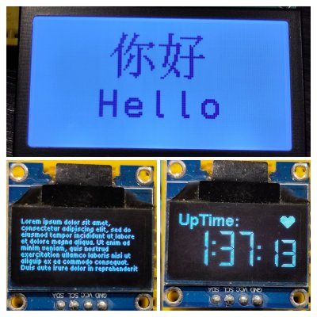
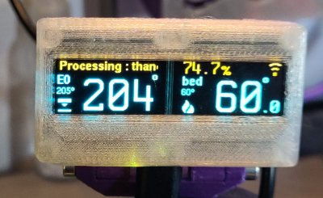

# Fonts and Font Writer for the MicroPython framebuffer

A collection of fonts and a writer for them, sourced from the [u8g2](https://github.com/olikraus/u8g2) project and packaged for use on small devices, with small displays, running [MicroPython](https://micropython.org/).

They will work with **`EZ FrameBuffer Font Writer`** (see below).
* This is optimised for ease of installation and use; especially for small 'info panel' type projects and will work with *any* display that has a driver for the built-in microPyton [framebuffer](https://docs.micropython.org/en/latest/library/framebuf.html).

And will also work with Peter Hinches comprehensive [writer](https://github.com/peterhinch/micropython-font-to-py/blob/master/writer/WRITER.md) class and [nano-gui](https://github.com/peterhinch/micropython-nano-gui/tree/master).

The fonts presented here were created using my own `bdf2dict` font module creator, see below.

-----------------

# Writer: `ezFBfont.py`
The writer class `exFBfont.py` works with these fonts, it takes a string to write, plus X and Y position, and writes the string in that position in the selected font. There are color, transparency, spacing and positioning options, plus functions to give info about the written area and support for multi-line strings.

For more see the documentation in [`WRITER.md`](WRITER.md), there are examples of using this in the [examples](examples) folder.

# Marquee: `ezFBmarquee.py`

A simple marquee / scrolling banner display that uses the fonts from this repo. You can define an output 'box' and the string will be scrolled within that. Supports a couple of 'modes' for the scroll, adjustable character spacing and step rate.

Details are in [`MARQUEE.md`](MARQUEE.md), and examples of driving the animation with an IRQ timer loop are in the examples folder.

# Font Packs

Font files are in the [`Latin-1`](Latin-1) and [`Symbols`](Symbols) folders as appropriate.
* See the `README` in each for a description, a map of all the fonts and heights, and other considerations.

The selection provided here was derived from the default U8G2 fonts; it contains common X11 fonts, the 'spleen' small font set, OpenIconic icons, tiny fonts, and some symbol and other icon fonts too.

They are all derived from **112** open and redistributable *.bdf* font definition files covering 11 font families. These have been packed into *.py* font modules based on the character set(s) they contain.

Fonts are generated and stored by font family, then character set and vertical size.
* 560 **Latin-1** font modules cover the basic latin character sets in groups of related characters.
* 144 **Symbol** modules cover specialist symbol fonts (battery, 7 segment, etc) and the Open Iconic icon sets.
* **Unicode** font modules need to made on demand using the `bdf2dict` tool, see the Unicode [README](/Unicode/README.md) for details.
  * There is no sensible way of grouping Unicode fonts into packs that are small enought to be useful on micropython devices. The most popular blocks have thousands of characters in them and the resulting files are too large to use sensibly.
  * The `bdf2dict` tool is designed to be easy to install and use, just requiring Python3.7 or higher.
  * You can specify your own charset when prompted on the command line (or via a file/arguments/stdin).
  * The script will output a python font module containing only the characters requested, plus an ascii-art map of the glyphs.
  * The [efont](http://openlab.ring.gr.jp/efont/) unicode fonts are provided in the Unicode folder, but other fonts in the Latin-1 folder also provide unicode characters; these are noted in the README.

All provided font modules contain and retain the original copyright notices from the source '.bdf' files, most are very 'free'; but the proportional X11 derived fonts need extra consideration. See the documentation on the font index pages for more.

# Font creator: `bdf2dict.py`

All the fonts packs provided here were made with this tool, it is a simple to use CPythom (not microPython) script that can import and process a `.bdf` font file and extract just the characters you need into a `.py` font file. I is fully compatible with Unicode characters and fonts.

See [`BDF2DICT.md`](BDF2DICT.md) for documentation and usage instructions, the [Unicode](Unicode) README has a write-up and demonstration + example of using this to make a Unicode font for a project.

## Drivers

The font writer and marquee will work with **any** display that has a MicroPython **framebuffer** compatible driver.

A couple of common 'good' drivers for popular ssd1306 and st7567 displays are provided. Along with documentation on finding and using drivers for other displays in the [`drivers`](drivers) folder.

If you find a driver that works and is not in the list there please let me know by submitting a issue!

## Alternatives

If you are implementing a full 'GUI', or have a color display, especially a large(ish) one, then you should consider the alternatives below. They support large displays, full color displays, have GUI elements, are faster and use less memory..

The fonts in this repo will work with Peter Hinches `writer` and `nano-gui` classes:
* https://github.com/peterhinch/micropython-font-to-py/blob/master/writer/WRITER.md
  * This is a good class to use if you are driving a console type display since it has goodies like word-wrap, tab alignment, etc.
* https://github.com/peterhinch/micropython-nano-gui/tree/master
  * A good alternative to the complexity of LVGL (below), and my fonts work with it.

From the same author are the display drivers here:
* https://github.com/peterhinch/micropython-nano-gui/blob/master/DRIVERS.md
* These support several large color displays and can also use the fonts from this repo.

Another great resource, especially for display drivers, is at:
* https://github.com/bdbarnett/mpdisplay

And finally; for people building fast GUI's on color displays and who are willing to deal with more complex installs; there is [LVGL](https://lvgl.io/):
* https://docs.lvgl.io/7.11/get-started/micropython.html

-----------------

## Status

I created ezFBfont, the font packs and tooling to support a [project](https://github.com/easytarget/PrintPy2040) that I am currently working on, and several others I have planned.

This is a 3d printer status and progress display, driven by a Seeedstudio XIAO RP2040, and using my fonts + writer + marquee.

The fonts, writer and marquee  have been tested on a `ssd1306` OLED display, and a `st7567` LCD module, both using I2C, and driven by ESP32 *and*  RP2040 development boards.
