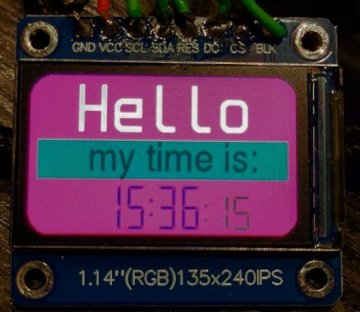

# Fonts and Font Writer for the MicroPython framebuffer

This is a set of fonts and a tool to use them, inspired by the [u8g2](https://github.com/olikraus/u8g2) project, and made for devices with small displays running [MicroPython](https://micropython.org/).

These font packs work with my **`Font Writer`** and **`Marquee`** classes (explained below).
* The writer and marquee are designed to be easy to install and use, especially for small 'info panel' type projects. They will work with *any* display that has a driver for the built-in MicroPython [framebuffer](https://docs.micropython.org/en/latest/library/framebuf.html).

***Additionally,*** these font packs also work with Peter Hinche's [writer](https://github.com/peterhinch/micropython-font-to-py/blob/master/writer/WRITER.md) class and [nano-gui](https://github.com/peterhinch/micropython-nano-gui/tree/master), **and** the `EZFont` class from Brad Barnett's [mpdisplay](https://github.com/bdbarnett/mpdisplay).

The font packs here were created using my `bdf2dict` font module creator (see below).

-----------------
# Latin-1 and Symbol Font Packs

The font files are in the [`Latin-1`](Latin-1) and [`Symbols`](Symbols) folders.
* Check the `README` in each folder for a description, a map of all the fonts, their sizes, and other details.

These font packs are based on the default U8G2 fonts. They include common X11 fonts, the 'spleen' small font set, OpenIconic icons, tiny fonts, and other symbol/icon fonts.

They come from **112** open and shareable *.bdf* font definition files covering 11 font families. These have been turned into *.py* font modules based on the character set(s) they include.

Fonts are organized by font family, then character set and size.
* 561 **Latin-1** font modules cover the basic Latin character sets in groups of related characters.
* 144 **Symbol** modules cover special symbols (battery, 7 segment, etc.) and the Open Iconic icon sets.

All font modules keep the original copyright notices from the source '.bdf' files. Most fonts are very 'free', but the proportional X11 fonts need extra attention. For more details, check the documentation on the font index pages.

# Unicode font packs?

It's not practical to group general Unicode fonts into small enough packs for MicroPython devices. The common Unicode blocks have thousands of characters, and the resulting files would be too large.

Instead, tools and examples are provided to help you make a custom font pack with only the characters you need.
* The `bdf2dict` tool (below) is easy to install and use, just requiring Python 3.7 or higher.
  * The [Unicode](Unicode/README.md) page has an example of how to use it.
  * The [unifont](https://savannah.gnu.org/projects/unifont) and [efont](http://openlab.ring.gr.jp/efont/) Unicode font *.bdf* sources are in the Unicode folder.

-------------------------

# Font Writer: [`ezFBfont.py`](ezFBfont.py)

The `ezFBfont.py` writer class works with these fonts. It takes a string and X, Y position, then writes the string at that position using the selected font. It has options for color, transparency, spacing, and positioning, and can provide info about the written area and support multi-line strings.

For more details, see the documentation in [`WRITER.md`](WRITER.md), and check out the examples in the [examples](examples) folder.

# Marquee: [`ezFBmarquee.py`](ezFBmarquee.py)

A simple scrolling banner display that uses the fonts from this repo. You can define an output 'box' and the string will scroll inside it. It supports different scroll modes, adjustable character spacing, and step rates.

For more information, see [`MARQUEE.md`](MARQUEE.md), and check the examples folder for examples of driving the animation with an IRQ timer loop.

# Font module creator: [`bdf2dict.py`](bdf2dict.py)

All the font packs were made using this tool. It is a simple-to-use CPython *(not MicroPython!)* script that can import and process a `.bdf` font file and extract only the characters you need into a `.py` font module file. It works with Unicode characters and fonts.

For more documentation and usage instructions, see [`BDF2DICT.md`](BDF2DICT.md) and the Unicode [readme](Unicode/README.md) for some Unicode fonts and an example of how to use this tool to create a custom font pack.

# Display Drivers

The font writer and marquee work with **any** display that has a MicroPython **framebuffer** compatible driver.

Common drivers for popular `ssd1306` and `st7567` displays are in the [`drivers`](drivers) folder. There is also documentation for finding and using drivers for other displays in the README there.

I also have [my own version](https://github.com/easytarget/st7789-framebuffer) of the popular ST7789 (color TFT) driver that has been tested with the Writer and Marquee classes.

If you find a driver that works but is not listed, please let me know by submitting an issue!

# Alternatives

If you're building a full 'GUI' or have a large color display, consider the alternatives below. They support bigger displays, full color, have GUI elements, are faster, and use less memory.

The fonts in this repo work with Peter Hinch’s `writer` and `nano-gui` classes:
* [Peter Hinch's writer class](https://github.com/peterhinch/micropython-font-to-py/blob/master/writer/WRITER.md)
  * This is a good class for console-style displays as it includes features like word-wrap, tab alignment, etc.
* [Peter Hinch's nano-gui](https://github.com/peterhinch/micropython-nano-gui/tree/master)
  * A good alternative to LVGL (below), and my fonts work with it.
* Peter also has a `micropython-font-to-py` tool for creating fonts that work with my writer and marquee classes.
  * Fonts from this tool are better for advanced users, as they use less RAM when compiled and frozen into firmware. See the `bdf2dict` readme for more info on this.

Also from Peter are these display drivers:
* [Peter Hinch's display drivers](https://github.com/peterhinch/micropython-nano-gui/blob/master/DRIVERS.md)
* These support large color displays and can also use the fonts from this repo.

Another useful resource for display drivers and GUI elements is Brad Barnett’s `mpdisplay`:
* [Brad Barnett's mpdisplay](https://github.com/bdbarnett/mpdisplay)
* The `EZFont` class in this tool (just one of several font classes) works with my `ezFBfont` packs.

Finally, for those building fast GUIs on color displays, there is [LVGL](https://lvgl.io/):
* [LVGL documentation](https://docs.lvgl.io/7.11/get-started/micropython.html)

-----------------

# Status

I created `ezFBfont`, the font packs, and tools to support a [project](https://github.com/easytarget/PrintPy2040) I am working on, as well as several others.

This is a 3D printer status and progress display, driven by a Seeedstudio XIAO RP2040, and using my fonts, writer, and marquee.
* It also uses another specialized MicroPython tool I created, [serialOM](https://github.com/easytarget/serialOM), which is a framework for fetching and syncing the RepRapFirmware [ObjectModel](https://docs.duet3d.com/en/User_manual/RepRapFirmware/Object_Model) via any serial stream. This tool works in both MicroPython and CPython.

The fonts, writer, and marquee have been tested on an `ssd1306` OLED display and a `st7567` LCD module using I2C, on both ESP32 and RP2040 development boards.

