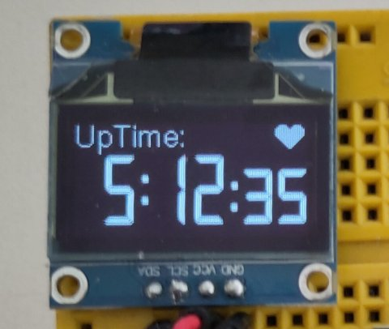

# examples`.
Not very well documented yet..

look in `i2c-ssd1306-demo.py` and `i2c-ssd1306-counter.py`

## Tested on ESP32 and ssd1306 I2C OLED.
clipping, colors, transparency, alignment all work.

