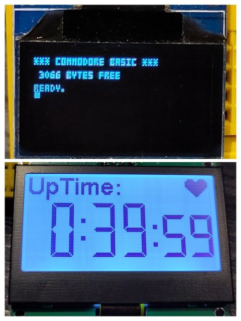

# examples

Examples for I2C ssd1306 and st7567 displays:

* 'demo   ' : just a bunch of fonts, colors and alignments. Goot for 'playing' with to see how things work in practice
* 'counter' : a simple uptime counter

See comments for pin assignments etc.

## These have been tested on displays connected to an ESP32 and to a RP2040
clipping, colors, transparency, alignment all work.

[](examples/doc/demo-collage2.jpg)

#### There are demos for the repl_1306 text-based test driver too:
```python
owen@sam: $ micropython
MicroPython v1.22.2 on 2024-03-22; linux [GCC 14.0.1] version
Use Ctrl-D to exit, Ctrl-E for paste mode
>>> import repl_1306
>>> d = repl_1306.REPL_1306(80,10)
repl_1306: init 80x10
>>> d.text('Hello',10,2)
>>> d.show()
repl_1306: show
................................................................................
................................................................................
...........##..##...........###.....###.........................................
...........##..##............##......##.........................................
...........##..##...####.....##......##.....####................................
...........######..##..##....##......##....##..##...............................
...........##..##..######....##......##....##..##...............................
...........##..##..##........##......##....##..##...............................
...........##..##...#####...####....####....####................................
................................................................................
>>>
```
